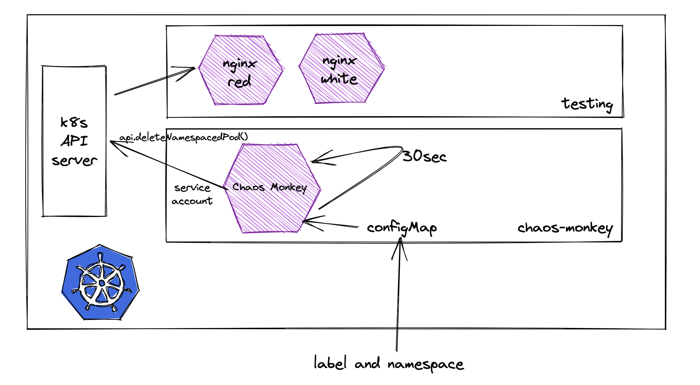

# chaos-monkey

Chaos-monkey is a k8s playground based on this [exercise](docs/exercise.pdf).

## Exercise

As a DevOps Specialist, you are being asked to create an application called
"ChaosMonkeyPod" that runs within a Kubernetes cluster and interacts with the Kubernetes
API server by deleting a random pod in the namespace “testing” on a schedule.

- Source code implemented in Java
- Dockerfile to build the image for the application
- Kubernetes manifests to run this in a cluster
- Dummy workloads in the “testing” namespace as target

#### Bonus

If you have extra time, consider adding an option that allows the application to kill pods only
if they have a specific label and document how a user would configure it.

## Requirements

- java 11 [Corretto-11.0.15.9.1 (build 11.0.15+9-LTS)]
- maven (3.6.2)
- container runtime (tested with Docker Engine v20.10.21)
- kubectl
- minikube (v1.28.0) **not strictly required***
- bash **not strictly required**

*solution tested also with GKE 1.25*

## Project Organization

```text
|-- docs # exercise guidelines
|-- http # dir with http rest call
|-- k8s # k8s manifests for chaos-monkey application
|-- src # source code
`-- testing_namespace # k8s manifests for testing namespace
```

## Proposed Solution



The exercise try to test the resilience of workloads in advance by injecting failures towards a deployment.

### k8s workloads definition

The testing environment has the following setup:

- nginx with 2 replicas labeled with ```app=red``` in namespace ```testing```
- nginx with 2 replicas labeled with ```app=white``` in namespace ```testing```

These workloads are defined with a [k8s deployment](https://kubernetes.io/docs/concepts/workloads/controllers/deployment/)
in ```./testing_namespace``` directory. I decided to use the deployment workload resource because it can automatically rollout in background
the pods in case of failure, which fits the actual use case and furthermore, [we don't need to guarantee ordering and uniqueness of Pods](https://kubernetes.io/docs/concepts/workloads/controllers/statefulset/).

```text
.
|-- nginx_red_label.yaml
`-- nginx_white_label.yaml
```


Instead, the application that injects pod deletions using the k8s API, is deployed with a [k8s pod resource](https://kubernetes.io/docs/concepts/workloads/pods/).
I used this k8s resource because from the description of the exercise is indicated to deploy a *ChaosMonkeyPod"* which
seems referring to a Pod but usually it's [discourage to use this kind in favour of workload resources like 
Deployment, ReplicaSet, StatefulSet because you cannot manage different state](https://stackoverflow.com/a/60570518). On
another hand, it's enough for the exercise the type of k8s resource assigned for the chaos-monkey application.

In order to access to the k8s API, it's necessary to grant the application (Pod) with rights that can delete a pod in another namespace. 
The service-account resource defines the grant level which in the ```default``` configuration isn't enough to achieve the
exercise goal. For this reason, I have created a [cluster role](https://kubernetes.io/docs/reference/access-authn-authz/rbac/)
which defines the permissions for a resource (in this case, the chaos-monkey deployment), and connected to 
a service-account with a [cluster role binding](https://kubernetes.io/docs/reference/access-authn-authz/rbac/#rolebinding-and-clusterrolebinding).

```text
.
|-- configMap.yaml
|-- pod.yaml
|-- role.yaml
|-- roleBinding.yaml
`-- serviceAccount.yaml
```

The Application is configured thanks to a configMap that is explained in the next paragraph.

### Chaos Monkey Application

The chaos-monkey application is a spring boot application equipped with an API and a scheduled job. The API and the scheduled
job destroy a random pod taken from a namespace and a label assigned to the deployment. The API is the following:

```text
GET /destroy

parameters:
- namespace
- label
```

Instead, the scheduled job (Quartz) takes the previous parameters through ```application.yaml``` that use environment variables
configured with a [configMap](https://kubernetes.io/docs/concepts/configuration/configmap/) and every 30 sec triggers a pod deletion.
By default, **the application is configured to kill a random pod with the label red**.

```text
.
|-- application
|-- model
`-- service
```
In the source code we can find mainly three packages ```application, model and service```. Application contains mostly
spring boot code (controller, configuration and scheduler). Instead model and service contains the logic behind the deletion
of the pod.

The application use the [official java api](https://github.com/kubernetes-client/java) to interact with Kubernetes cluster.

The application is tested with unit test and integration test.

## Considerations

The proposed solution is guided by the scenario hints present in the document. Another naive solution that can be proposed,
can reduce the pressure in the cluster. Instead of having a standalone application like this one, it's possible to create
a [k8s job](https://kubernetes.io/docs/concepts/workloads/controllers/cron-jobs/) that schedule a java (cli) containerized.
The actual code can be easily refactorized in a solution that can build a web application and a cli.

## How To run it

The entire scenario can be executed with a [bash script](/run.sh):

```shell
user@host$: chmod +x run.sh
user@host$: ./run.sh
```
in the same way we can clean the scenario with [clean.sh](/clean.sh).
